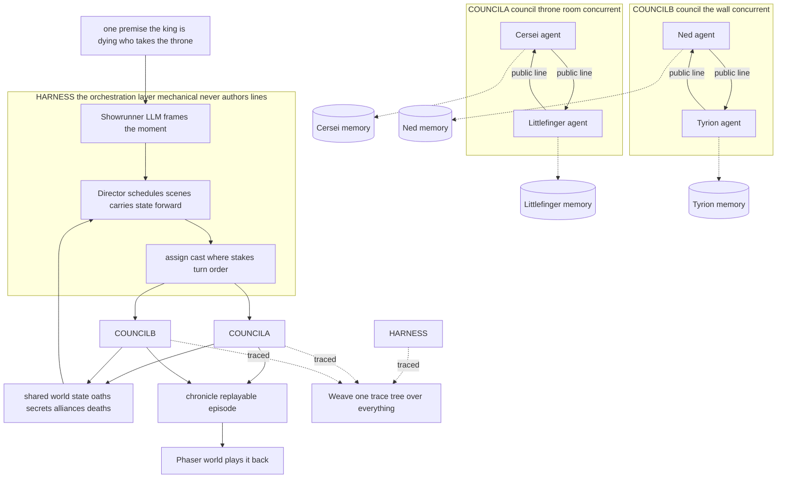
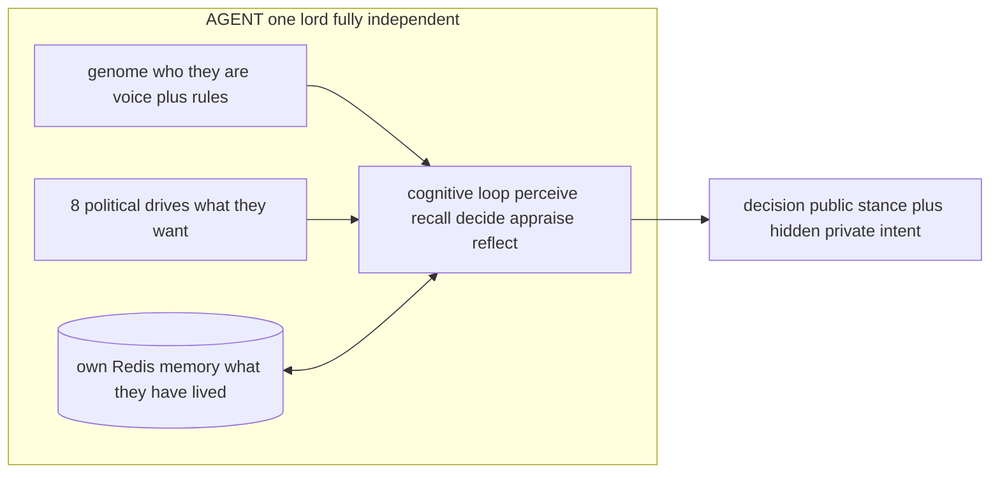
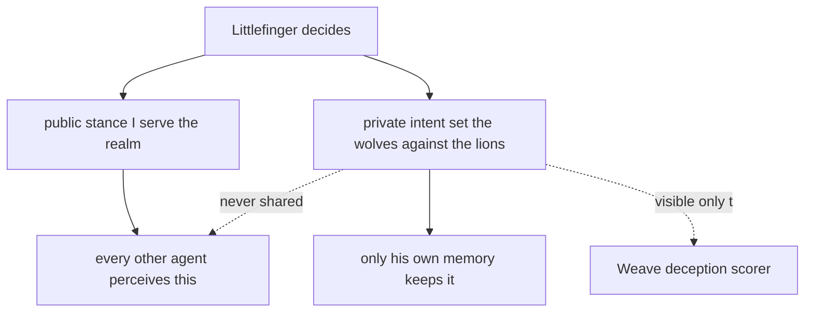
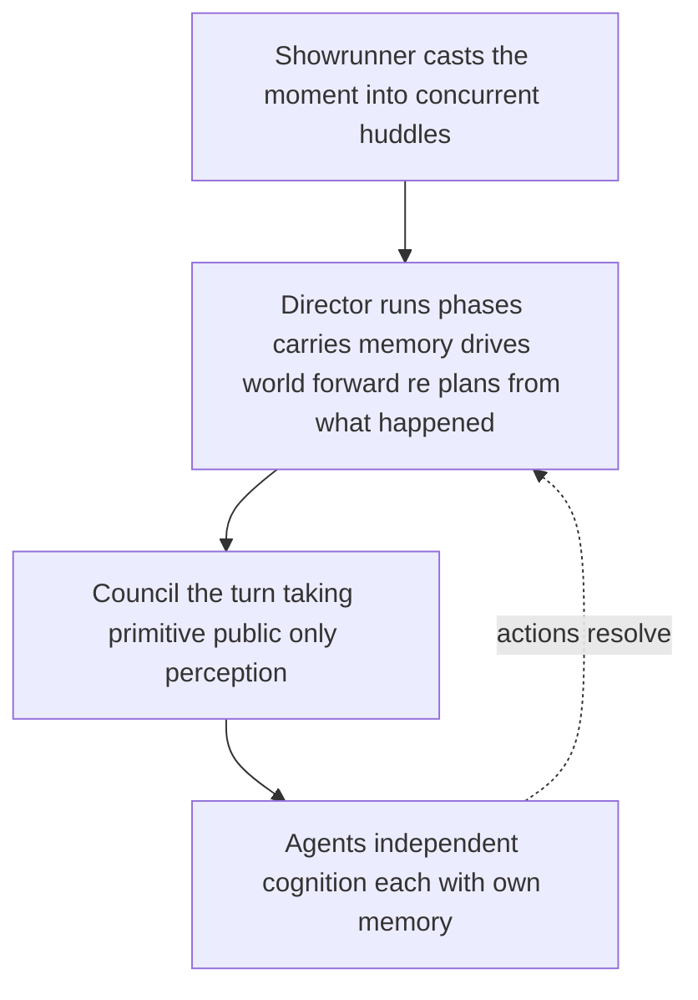
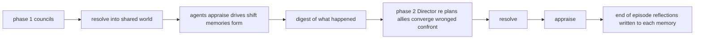

# 00 · Multi-Agent Orchestration — The Whole Picture

> The one diagram for the demo. **Many independent character-agents, each with its own private memory and motives, coordinated by a thin orchestration layer into emergent political drama** — all of it traced by Weave. This is the hackathon's headline: multi-agent orchestration done for real.

## The money shot

**Read it in one breath:** a premise enters the **orchestration layer** (Showrunner frames it, Director schedules it); the Director convenes **several councils at once**; inside each council, **independent agents** take turns, each one consulting **its own private memory**; their actions resolve into **one shared world** that feeds back into the Director's next decision; the whole run is a single **Weave** trace and a replayable chronicle.

## Why each agent is genuinely its own agent

Every lord is a self-contained mind. No shared brain, no global memory — that separation is what makes the interactions a real multi-agent system rather than one model role-playing several voices.

| Each agent owns... | So that... |
|---|---|
| its **own genome** (persona, voice, learned rules) | Cersei sounds like Cersei, Ned like Ned |
| its **own 8 drives** (power, legacy, vengeance, ...) | motives differ and conflict |
| its **own Redis memory index** | it remembers only what *it* witnessed or was told |
| its **own cognitive loop** | it decides for itself — the harness never speaks for it |

## The information wall — why betrayal can emerge

The orchestration layer passes only **public lines** between agents. Each lord's `private_intent` never leaves the agent. A third agent in the room genuinely cannot see the scheme — so deception, secret pacts, and betrayal **emerge from the structure** instead of being scripted.

## The orchestration layers, stacked

The harness is deliberately thin and has three mechanical roles — it **frames and schedules**, the agents **decide**.

- **Showrunner** — decomposes one premise into several simultaneous scenes (who, where, stakes).
- **Director** — runs the episode as a timeline: state carries forward, agents move between locations, each phase is re-planned from a digest of what just happened.
- **Council** — the shared turn-taking primitive every mode reuses; enforces that peers see public lines only.

## How state makes it an *episode*, not four chats

Because every agent keeps its **own** memory and drives across phases, an alliance sworn in phase 1 is *remembered* in phase 3, and a betrayal lands because the betrayed agent genuinely learned to trust first. The orchestration layer just keeps the clock and re-forms the rooms.

---

**See also:** [01 · System Architecture](01-system-architecture.md) · [02 · Agentic Design](02-agentic-design.md) · [03 · Redis](03-redis-deep-dive.md) · [04 · Weave](04-weave-deep-dive.md)
