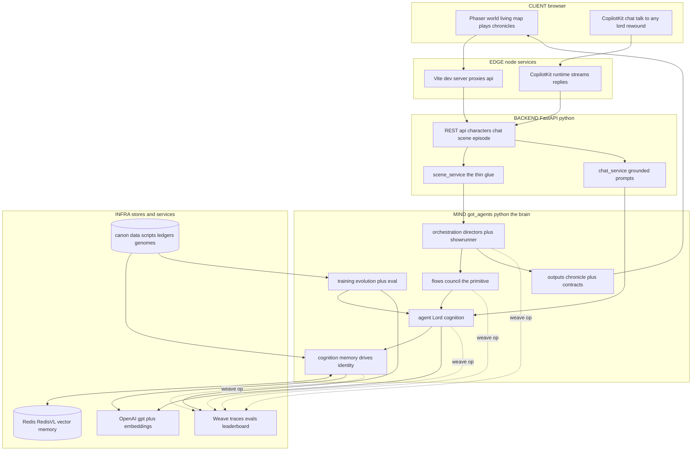
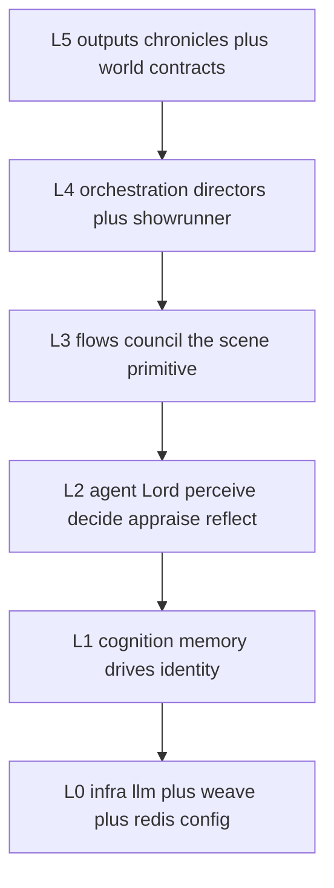
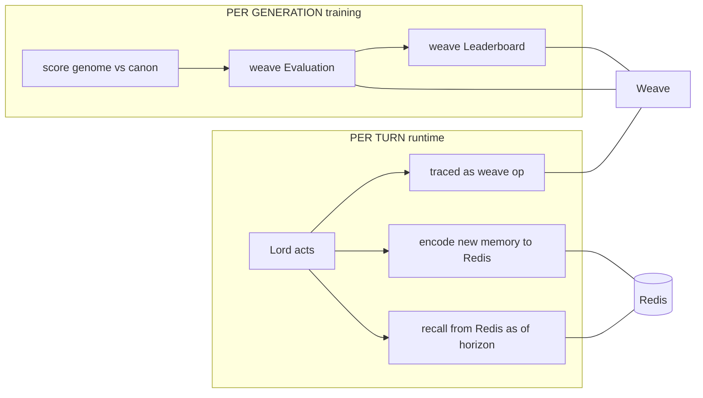
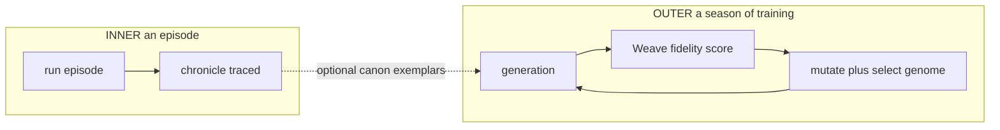

# 01 · System Architecture

> The whole stack, end-to-end. A **mind / body split**: the *body* is a TypeScript Phaser world that plays back episodes; the *mind* is a Python cognition + orchestration engine; **Redis** is the memory substrate; **Weave** traces and evaluates everything; **OpenAI** is the model provider.

## Full-stack topology

## The layers (down-only imports — the load-bearing rule)

The codebase enforces a strict **import direction**: `agent/` and everything below it never import `flows / world / orchestration`. That "chatbot test" is what keeps a single character runnable in isolation (for chat and for clean eval) while the harness composes them above.

| Layer | Module | Responsibility |
|---|---|---|
| L0 | `infra/` | `llm` (complete / complete_json / embed), `weave_setup`, config |
| L1 | `cognition/` | **Redis** memory store, 8 political drives, identity |
| L2 | `agent/` | `Lord` — the cognitive loop + the deception substrate |
| L3 | `flows/` | `run_council` + the showrunner planners |
| L4 | `orchestration/` | directors that stage whole episodes |
| L5 | `outputs/` | chronicles + the locked JSON contract the world plays |

## Where Redis and Weave sit

- **Redis** is the *runtime substrate*: every character's episodic memory is a vector index it reads at decision time and writes after reflection. Deep dive → [03](03-redis-deep-dive.md).
- **Weave** is the *observability + science substrate*: every cognitive op is a trace, and the training loop publishes evals + a leaderboard. Deep dive → [04](04-weave-deep-dive.md).
- **OpenAI** (`gpt-5.5` + `text-embedding-3-small`) is the model provider, auto-patched into the Weave trace tree. A single `LLM_PROVIDER` env flag swaps to Azure OpenAI.
- **Postgres** is wired in config but intentionally unused — canon lives as versioned JSON (ledgers, skeletons, genomes) so the whole world is reproducible from the repo.

## Two timescales

The **inner loop** is one episode of the harness (memory + drives accumulate). The **outer loop** is evolution across episodes (the genome's voice improves). They are deliberately separate climbs so each is measured cleanly.
