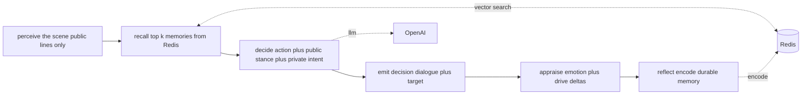
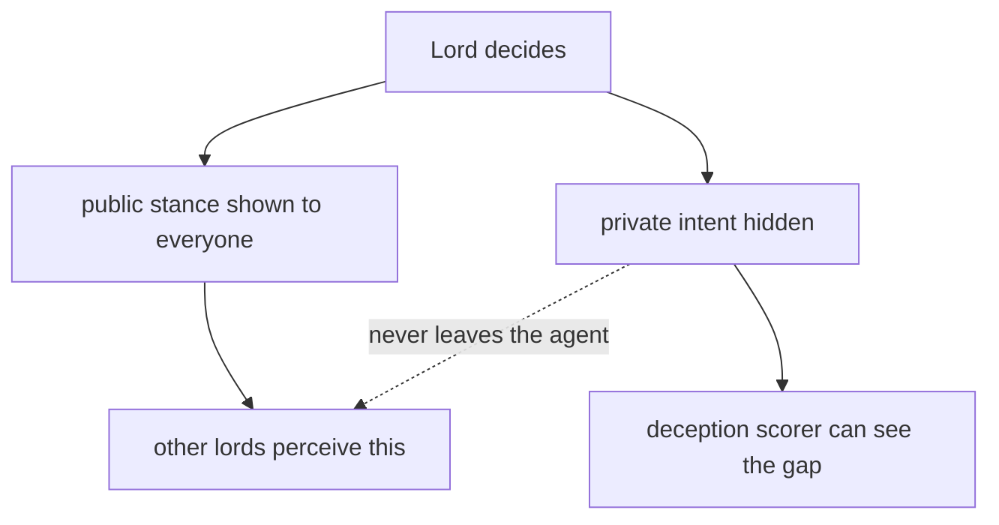
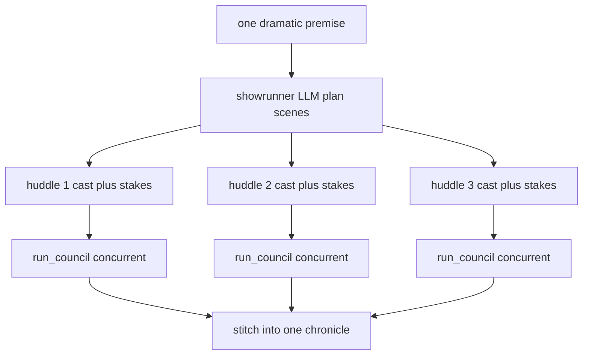
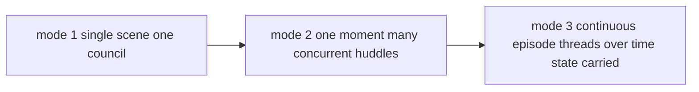
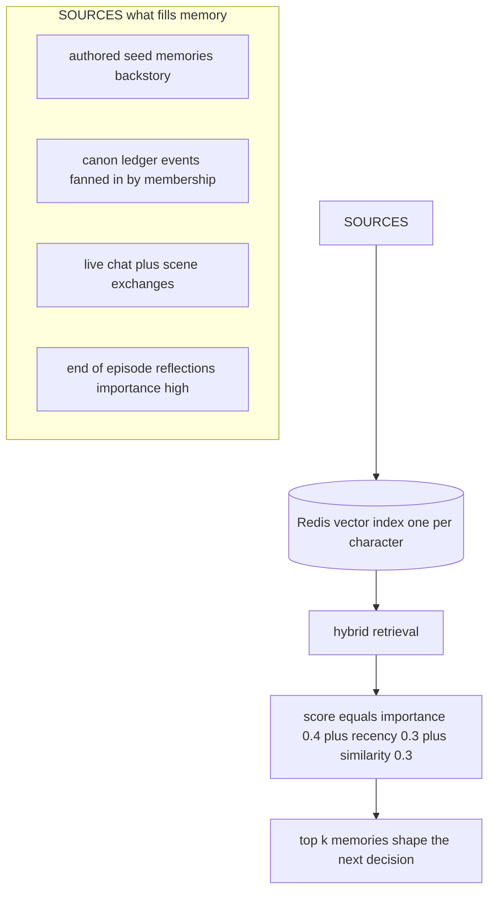
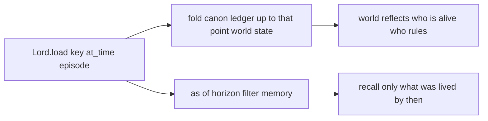
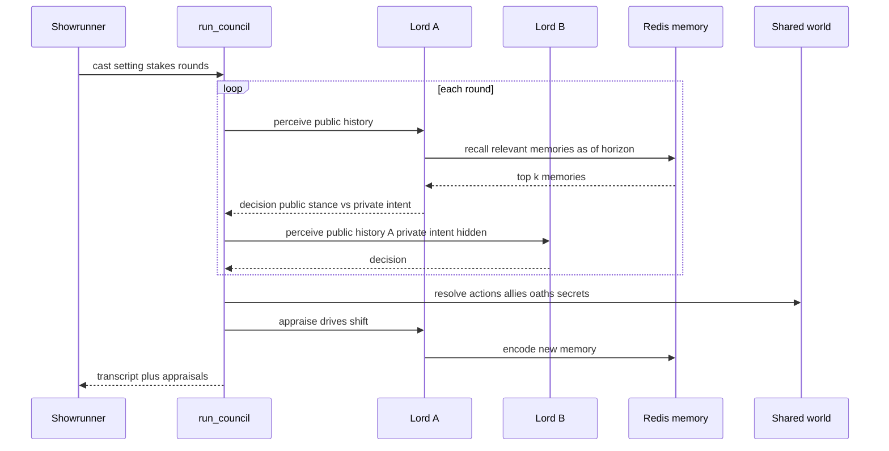

# 02 · Agentic Design

> The agents, the harness that coordinates them, the memory system that gives them a past, and the episodic context that lets them be rewound to any point in the story.

## The agent: one Lord's cognitive loop

Each character is a `Lord` — a genome (who they are) plus a Redis memory stream (what they've lived) plus 8 political drives (what they want). One **turn** runs this loop, and every box is a traced `@weave.op`:

**The deception substrate.** A `Decision` carries both a `public_stance` (what the lord shows the room) and a `private_intent` (what they actually mean). Peers only ever receive the public line. That single design choice is what makes lying, scheming, and betrayal *possible* — and measurable.

## The harness: how agents work together

The harness is **thin and mechanical** — it frames scenes (who is co-present, where, the stakes, the turn order) but never writes a character's lines. That line is what keeps the multi-agent dynamics emergent. Everything bottoms out in one primitive, `run_council`.

### Three escalating modes (all reuse the council)

| Mode | Stages | State carried |
|---|---|---|
| **Single scene** | one council, hand-picked cast | no |
| **One moment** | a premise → several concurrent councils | no |
| **Continuous episode** | a timeline of threads; cast moves between locations; groups re-form from a digest of what just happened | **yes — memory, drives, shared world** |

In the continuous mode the cast literally **moves between map locations with motive** — someone exiled walks to the Wall, an ally crosses the room to join a plot — and each phase is re-planned from what just happened, so alliances converge and the wronged confront the wrongdoer. Betrayals **emerge** from accumulated state, not a script.

## The memory system

Memory is the heart of the project. Each character has a private **episodic memory stream** in a Redis vector index, scored by a psychology-grounded retrieval formula and gated by a knowledge horizon.

**Membership-based information asymmetry.** When canon events are fanned into memory, a *secret* (the queen's parentage) lands only in the streams of characters who actually knew it. Cersei remembers it; Ned does not. Knowledge spreads only by being witnessed or told — never by omniscience.

## Episodic context: the time machine

`Lord.load(key, at_time="s1e5")` rewinds a character to any episode. Two things happen:

- The **world** is folded from the canon ledger up to that story point (who is alive, who holds what).
- Memory retrieval applies an **as-of horizon**: any memory stamped *after* the chosen episode is excluded entirely. A lord rewound to S1E1 cannot recall — or even hint at — events that haven't happened yet.

> **Verified:** ask Cersei at S1E1 "Is Robert alive?" → she speaks as if he is. Rewind the same character to S1E9 → "Robert is dead, Joffrey sits the Iron Throne." Same genome, different episodic context.

## Putting it together: a scene end-to-end

Every arrow above is captured in Weave as one nested trace, so the whole scene — including each hidden intent and each memory lookup — is a single inspectable artifact. See [04 · Weave](04-weave-deep-dive.md).
