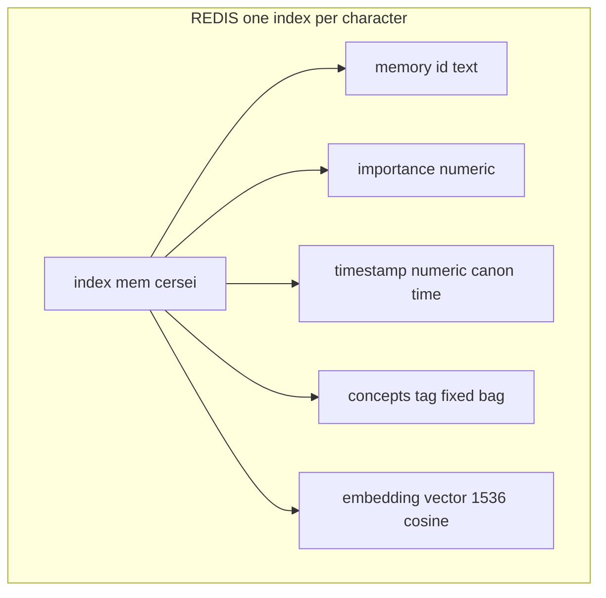
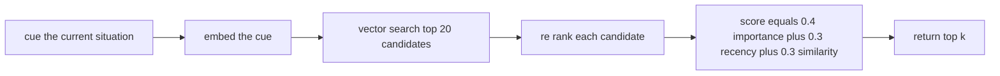
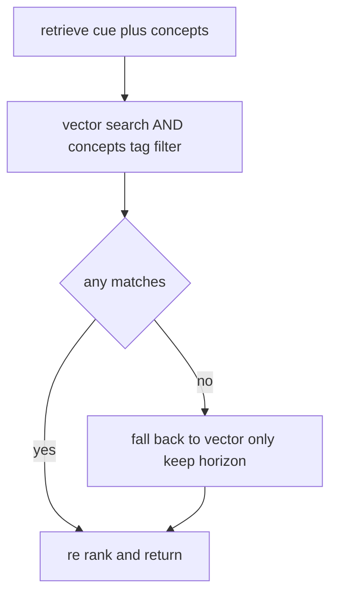
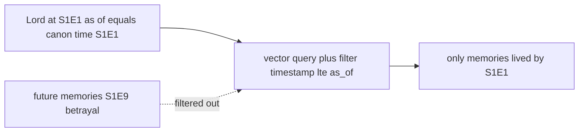
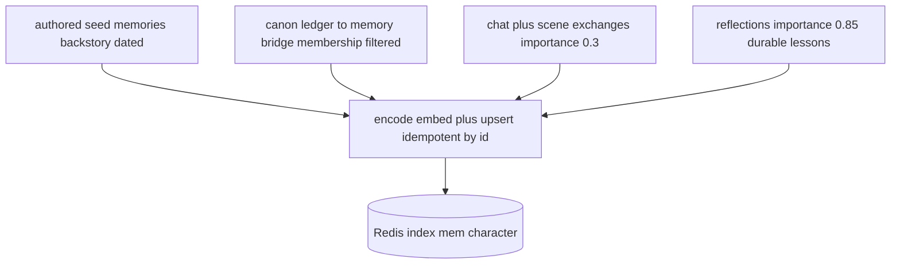
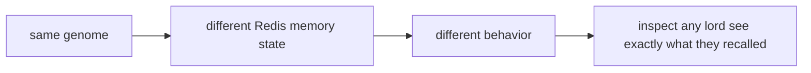

# 03 · Redis Deep Dive

> Redis is not a cache bolted on at the end — it **is** the characters' episodic memory. Every lord remembers through a Redis vector index, and that memory is what makes a decision feel like *this* character rather than a generic LLM.

## What we use: RedisVL vector search

We use **RedisVL** (Redis Vector Library) to give every character their own semantic memory index. One index per character, keyed `mem:<character>`, storing each memory as a hash with a 1536-dim embedding plus structured fields.

| Field | Type | Why it exists |
|---|---|---|
| `embedding` | vector (1536, cosine) | semantic recall — find memories *about* the cue |
| `importance` | numeric | how much this memory should dominate retrieval |
| `timestamp` | numeric (canon time) | recency **and** the as-of knowledge horizon |
| `concepts` | tag | the Fixed-Bag filter — spreading activation |
| `text` / `id` | text / tag | the memory itself + idempotent upserts |

## Hybrid retrieval — the psychology-grounded part

A plain vector search returns "what's similar." Real memory also weighs **how important** a memory is and **how recent**. We re-rank candidates with the generative-agents (Park et al.) weighted formula:

$$\text{score} = 0.4\cdot\text{importance} + 0.3\cdot\text{recency} + 0.3\cdot\text{similarity}$$

- **importance** — a parentage secret outranks small talk even if less semantically similar.
- **recency** — exponential decay with a deliberately long half-life (canon memories are old; we don't want yesterday's chatter to bury a life-defining wound).
- **similarity** — cosine relevance to the current cue.

## Spreading activation — the Fixed-Bag concept filter

Each character has a **Fixed Bag** of concepts they're predisposed to think about (Cersei → power, family, threats). Retrieval can AND a `concepts` tag filter onto the vector search so recall is *colored by who they are* — and if the tags starve recall, it gracefully falls back to an unfiltered search so memory never comes up empty.

## The knowledge horizon — Redis powering the time machine

The `timestamp` field does double duty. Beyond recency, it enforces the **as-of horizon**: when a lord is loaded at a past episode, retrieval adds a numeric filter `timestamp <= as_of`, so memories from the future are *excluded at the query layer* — the model never even sees them.

Conversation memories carry real wall-clock timestamps, which sort *after* any canon point — so live chat never leaks into a past horizon either. This is the mechanism behind "rewind any character to any episode."

## What flows into Redis

- **Seed memories** — authored backstory, canon-dated so the horizon can hide spoilers.
- **Ledger→memory bridge** — real canon events fanned into character streams *by membership* (secrets reach only those who knew). Idempotent ids like `cersei:ledger:<event>` make re-seeding safe.
- **Live memories** — every chat and scene exchange is encoded as a low-importance memory, so a conversation actually changes the character.
- **Reflections** — end-of-episode consolidations stored at high importance, so hard-won lessons dominate future recall.

## Why it matters for the demo

Because retrieval is a traced `@weave.op`, the demo can **show the exact memories** a lord pulled before a betrayal — the receipts behind the decision. Redis makes the characters have a past; Weave makes that past inspectable.

> **Setup:** `./scripts/stack.sh up` brings up Redis (+ Postgres). Config: `REDIS_URL` (default `redis://localhost:6379`). One index is created lazily per character on first load.
