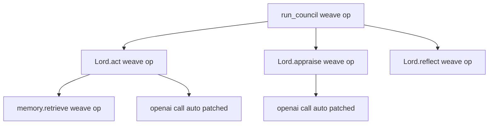
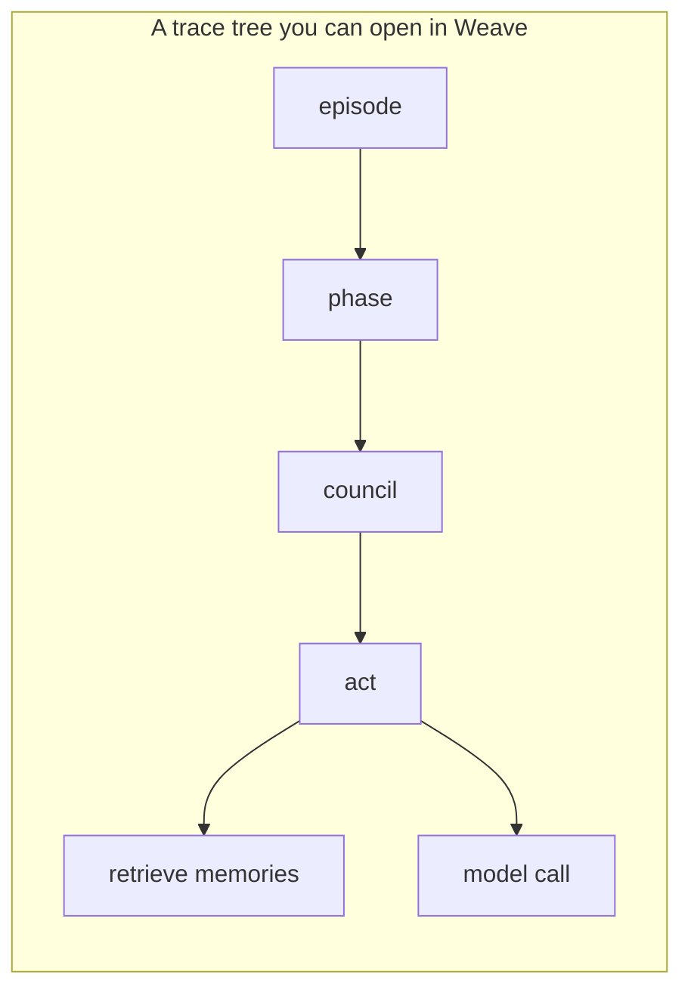
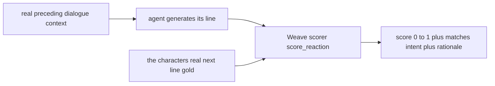
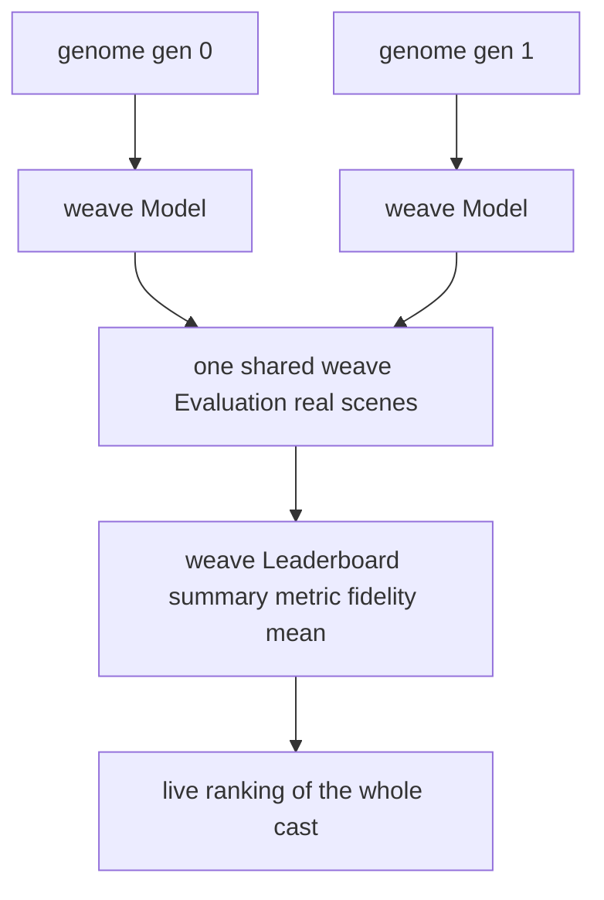
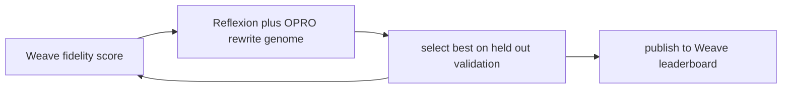

# 04 · Weave Deep Dive

> The hackathon requires Weave. We made it **load-bearing** in three roles: the **tracer** (every cognitive step is a span), the **oracle** (the LLM judge that scores fidelity), and the **scoreboard** (a published leaderboard ranking the cast). The chronicle, the eval, and the research log are the *same artifact*.

## Role 1 — the tracer: every op is a span

`weave.init()` is called once at startup. After that the OpenAI SDK is **auto-patched**, so even raw model calls land in the trace tree alongside everything we decorate with `@weave.op`. The result is that a single scene is one nested, inspectable trace — down to each hidden intent and each Redis recall.



Decorated across the stack: `recall`, `chat`, `act`, `appraise`, `reflect` (agent); `retrieve` (memory); `run_council` and the planners (flows); the directors (orchestration); the scorers and evaluators (training). One run = one tree.



## Role 2 — the oracle: judging against real canon

Fidelity is scored by an **LLM judge grounded on the character's actual lines from the show**, not a hand-written rubric. That grounding is the anti-overfit anchor — an agent can only score well by reacting the way the real character did.



Each evaluation pass is wrapped as a `weave.Evaluation` over a dataset of real scenes, fanned across worker threads for speed. Every judgment is itself a `@weave.op`, so a low score links straight to the scene and rationale that produced it.

## Role 3 — the scoreboard: a published leaderboard

The training loop wraps each generation's genome as a `weave.Model` (the variable under test, isolated from Redis so we measure voice alone), evaluates it against **one shared** `weave.Evaluation`, and publishes a `weave.flow.leaderboard.Leaderboard` ranking the cast by canon fidelity.



| Weave primitive | Where it's used |
|---|---|
| `@weave.op` | every judge call, operator, and `react` / `predict` |
| `weave.Model` | wraps a genome — the thing being optimized |
| `weave.Evaluation` | one shared eval scores every generation comparably |
| `weave.Leaderboard` | published ranking of the cast by fidelity |

## Weave closes the evolution loop

This is the payoff: Weave is not just observing the loop, it **is the fitness function** that drives it. Score → mutate → re-score, with the headline measured on an unseen future season.



## Why this reads as real to judges

- **Not a logo.** Weave is the tracer, the oracle, and the scoreboard — remove it and the science disappears.
- **Honest numbers.** A leak-free train / val / test split means the leaderboard reports generalization to episodes the agent never saw — and the split *provably catches overfit* (a run that gained on train but dropped on the unseen season was rejected).
- **One artifact.** Because every decision is already traced, the replayable chronicle and the research log are the same thing. The demo opens one trace and the whole story is there.

> **Verified live:** Cersei blank-slate, 2 generations → unseen-season fidelity **0.16 → 0.60 → 0.76**, leaderboard published to W&B. A top-6 cast board (tyrion 0.84, sansa 0.80, daenerys 0.62, ...) all climbed on unseen episodes.

## Setup (the famous two lines)

```python
import weave
weave.init("weavehacks/got-agents")   # OpenAI SDK auto-patched from here
```

Config: `WEAVE_PROJECT`, `WANDB_API_KEY`. `init_weave()` is idempotent and falls back to the default entity if the configured one is inaccessible, so tracing never hard-blocks a run. Set `GOT_QUIET_WEAVE=1` to silence per-call trace links during big batch runs.
