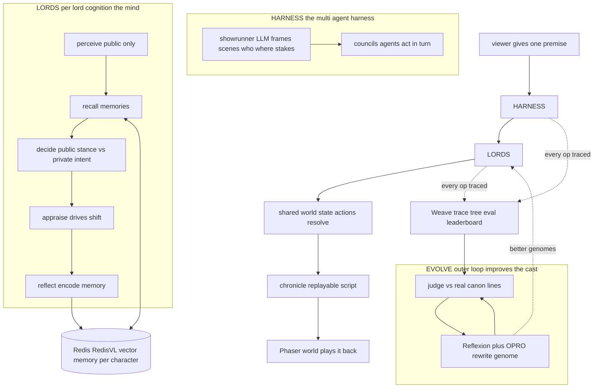

# A Game of Agents — Presentation Deck

> Generative **Game of Thrones** political simulation. Canon-seeded LLM lords scheme, ally, and betray inside a traced, evaluable, self-improving harness. Every decision is a Weave trace; every memory lives in Redis; every character can be rewound to any episode and improves generation over generation.

This folder is the **one-glance picture** of the system for the demo. Five boards — start with **00**:

| Board | What it shows |
|---|---|
| [00 · Multi-Agent Orchestration](00-multi-agent-orchestration.md) | **The hero diagram** — many independent agents, each with its own memory, coordinated by the orchestration layer into emergent drama. |
| [01 · System Architecture](01-system-architecture.md) | The whole stack end-to-end — frontend, backend, the Python mind, **Redis**, **Weave**, OpenAI, data. |
| [02 · Agentic Design](02-agentic-design.md) | The agents, the **multi-agent harness**, the **memory system**, and **episodic context** (rewind). |
| [03 · Redis Deep Dive](03-redis-deep-dive.md) | How Redis (RedisVL) is the characters' episodic memory — hybrid retrieval + the knowledge horizon. |
| [04 · Weave Deep Dive](04-weave-deep-dive.md) | How Weave is the tracer, the **oracle**, and the **leaderboard** — not a logo. |

## The one diagram

## The four things that make this impressive

1. **A real harness, not a chatbot.** A showrunner frames scenes; the agents decide. Peers never see each other's `private_intent`, so deception and betrayal **emerge** — they are not scripted.
2. **A memory system with a time machine.** Each character's episodic memory lives in a Redis vector index; an **as-of knowledge horizon** means a lord rewound to S1E1 literally cannot recall the future.
3. **Self-improving against ground truth.** Characters are judged against their **real lines from the show** and rewrite themselves (Reflexion + OPRO), with a leak-free train/val/test split so the climb is honest.
4. **Weave is load-bearing.** The chronicle, the eval, and the research log are the *same traced artifact* — published as a live leaderboard.

See also the as-built engineering notes: [Multi-Agent Orchestration Overview](../Project%20-%20A%20Game%20of%20Agents/Multi-Agent%20Orchestration%20Overview.md) and [Training & Evaluation Overview](../Project%20-%20A%20Game%20of%20Agents/Training%20%26%20Evaluation%20Overview.md).
